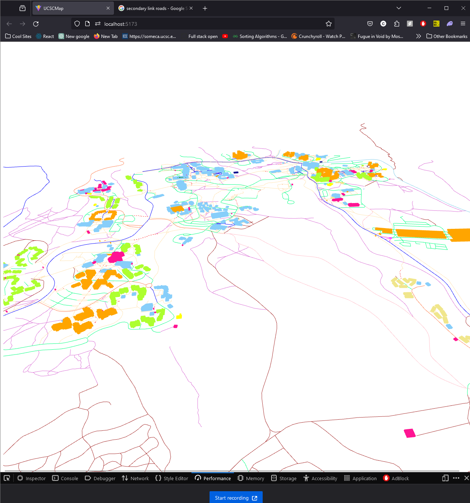

# UCSC Campus Map Project

## Overview
This project presents an interactive 3D map of the University of California, Santa Cruz (UCSC) campus. The map utilizes GeoJSON data sourced from OpenStreetMap and is rendered using the Three.js library. This interactive tool allows users to click on various campus buildings and obtain routes between them, courtesy of the OpenRoute Service.

The primary aim of this project is to provide an easy-to-use template for building 3D maps web applictions. 

## Features
- **Interactive 3D Map**: Explore the UCSC campus in three dimensions.
- **Building Information**: Click on any building to see detailed information logged to the console.
- **Routing**: Get custom routes between buildings directly on the map using OpenRoute Service.
- **Color Coding**: Buildings and routes are color-coded for easier identification.

## Using the Map
To use the map, simply click on any building to view its information logged in the console. If you want to find a route from one building to another, click on your starting building, then select your destination, the route will be logged in your console. 

## Screenshot
Here is a screenshot of the map in action:


## Technical Details
- **GeoJSON Data**: Data is pulled from OpenStreetMap.
- **Rendering Engine**: The map is rendered using Three.js.
- **Routing Service**: Routes are calculated using the OpenRoute Service.

## Installation
Clone the repository to your local machine:
```bash
git clone https://github.com/bkcastro/UCSCMap.git
cd your-project-directory
